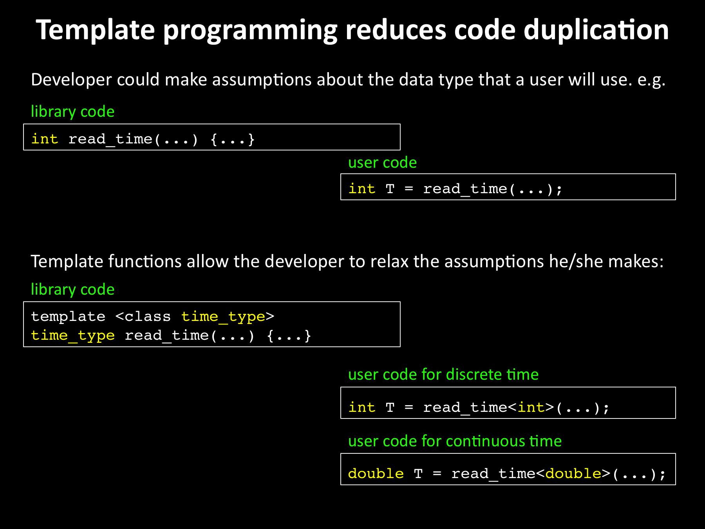
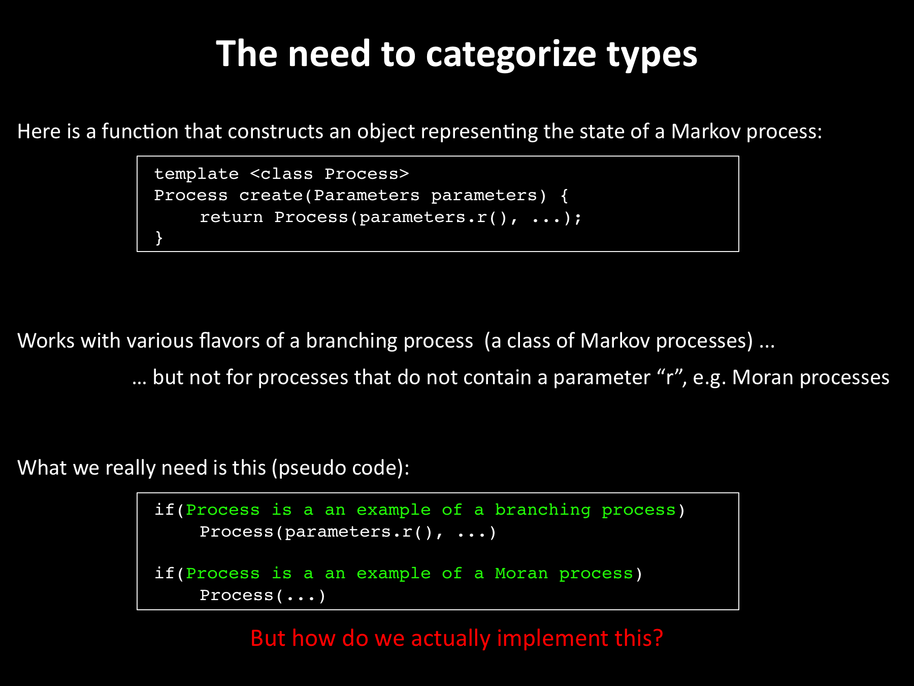
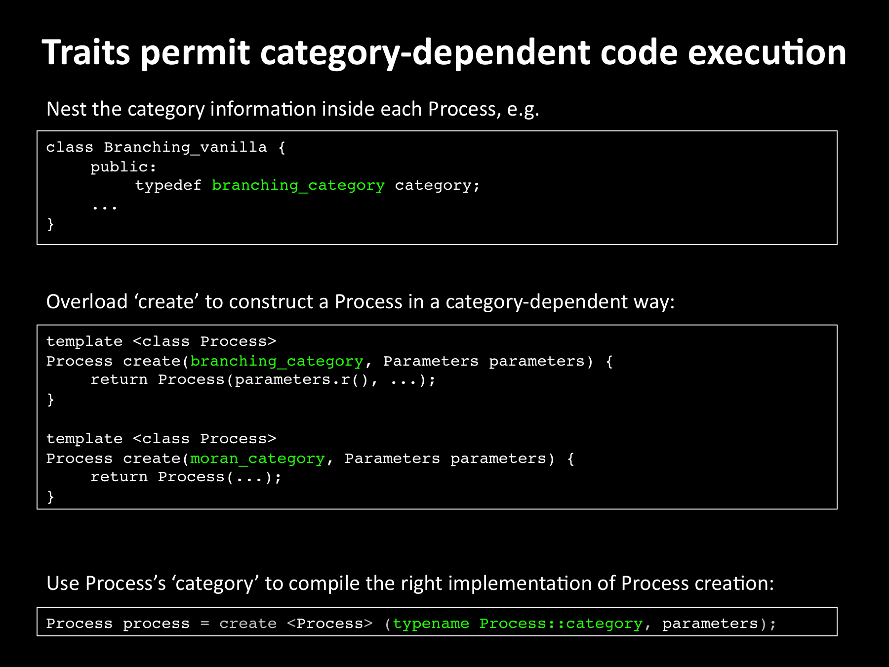

# mutation_accumulation
C++ template library to perform performance-critical Monte Carlo simulations of the accumulation of mutations in individual stem cells.  `mutation_accumulation` was written primarily to produce the results reported in [this cancer systems biology paper](http://journals.plos.org/ploscompbiol/article?id=10.1371/journal.pcbi.1003802). Includes implementations of Scott Meyers' programming tips ("items") outlined in [Effective C++: 55 Specific Ways to Improve Your Programs and Designs (3rd edition; 2005)](https://www.amazon.com/Effective-Specific-Improve-Programs-Designs/dp/0321334876). 

### Getting started
Installation is easy because the `mutation_accumulation` library consists entirely of header files, requiring no separately-compiled library binaries or special treatment when linking.

* download this repository
* download the [Boost C++ library](http://www.boost.org/) 
* navigate to the `example` directory of `mutation_accumulation` and execute the following command in the shell
```unix
g++ -I<path to boost library> -I<path to mutation_accumulation library> main_branching_CDF_trajs.cpp
```
* run the executable so generated in the `trajectories` and `cdf` sub-directories (you'll find that output has already been generated there for later use)
* look at this [Jupyter Notebook](http://nbviewer.jupyter.org/github/petermchale/mutation_accumulation/blob/master/example/analysis.ipynb), which showcases a brief mathematical analysis of the data

### Template programming
C++ templates allow classes to operate with many different data types without being rewritten for each one: 



The example below (taken from the `example` directory) shows how templates can be used to easily code up a particular mathematical model with the appropriate types for variables such as the number of stem cells and time. It also illustrates how templates may be used to define how the simulation should interpret the entries in the input file, and how it should gather statistics. 
```C++
#include <mutation_accumulation/simulation/calculate_histogram_trajs.h> 
#include <mutation_accumulation/configuration/configuration/branching_discrete.h> 
#include <mutation_accumulation/probability/notification_policy.h> 
#include <mutation_accumulation/probability/cdf.h> 
#include <mutation_accumulation/simulation/raw_data.h>

/*************************************************************************/

int main() {

    typedef long long int population_type;
    typedef monte_carlo::Branching_Discrete<population_type> Configuration_Policy;

    typedef Configuration_Policy::time_t time_type;
    typedef probability::Notify_NonNegative_BoundedAbove<time_type> Notification_Policy;
    typedef probability::CDF<Notification_Policy> Histogram_Policy;

    monte_carlo::Calculate_Histogram_Trajs<Histogram_Policy, 
                                           Configuration_Policy, 
                                           monte_carlo::Raw_Data_Null, 
                                           monte_carlo::Read_NonHomeostasis_Policy>::implement();
}
```
### Traits as a means to provide additional information about types




